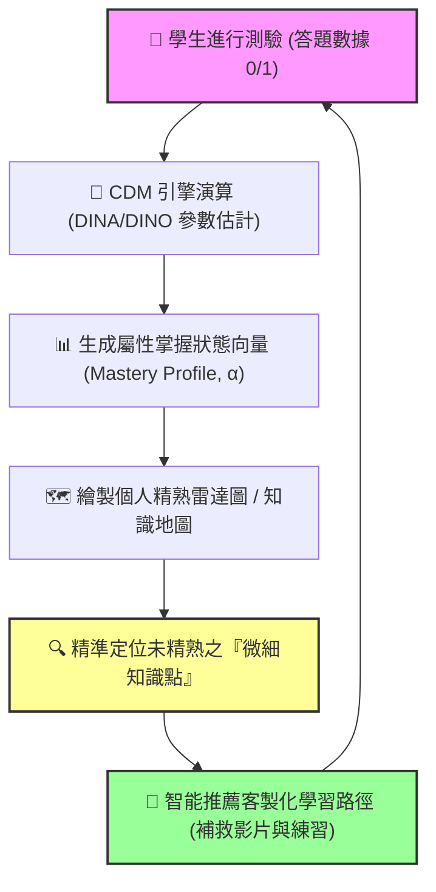

在數位學習與教育科技爆發的今天，你可能聽過 **「自適應學習（Adaptive Learning）」** 或 **「AI 智能導學」**。像教育部極力推廣的 **「因材網」**、**「均一教育平台」**，標榜能夠在學生做完幾題測驗後，立刻畫出精準的「雷達圖」，告訴你：「你不是數學不好，你只是『分數約分』這個概念沒學會！」

這種能夠「看穿」學生大腦知識結構的黑科技，背後的核心數學引擎正是 **認知診斷模型 (Cognitive Diagnostic Models, CDM)**。

今天這篇文章，我們就來徹底拆解這個在 108 課綱下發光發熱的「素養新星」，看看心理計量學家是如何利用統計模型為學生開出「學習診斷書」的。

---

## 1. 什麼是認知診斷模型 (CDM)？

在傳統測驗理論中，不論是 **古典測驗理論 (CTT)** 還是 **項目反應理論 (IRT)**，本質上都是在做 **「宏觀的篩選與分流」**：
*   **CTT**：告訴你這張考卷你考了 $60$ 分（只有單一加總分數）。
*   **IRT**：估計出你的整體能力值 $\theta = 0.5$（單一維度的潛在能力坐標）。

然而，這兩種理論都無法回答一個最關鍵的教學問題：**「考 60 分的學生，到底是哪一個具體知識點不會？」** 兩個同樣考 60 分的學生，可能一個是「幾何題全對、代數題全錯」，另一個是「代數題全對、幾何題全錯」。如果給予他們完全相同的補救教學，效率將會極低。

**認知診斷模型 (CDM)** 應運而生。它的目標是 **「微觀的診斷與回饋」**：
它將學科能力拆解為多個微觀的 **「認知屬性（Attributes, $\alpha$）」**，並透過受試者的答題對錯，推估出受試者對各個屬性的精熟狀態（Mastery Profile）。

> [!TIP]
> 診斷結果通常以二元向量表示：$1$ 代表「已精熟」，$0$ 代表「未精熟」。
> 例如，某位學生在「分數加減法」單元中的精熟狀態為 $\alpha = [1, 0, 1]$，代表他已掌握「通分」與「加減計算」，但尚未掌握「約分」。這就是個人的**知識地圖**。

---

## 2. CDM 的心臟：Q 矩陣 (Q-matrix)

要運行 CDM，必須先由學科專家與計量專家共同建構一張對照表，這張表被稱為 **Q 矩陣 (Q-matrix)**。

Q 矩陣是聯結 **「測驗題目」** 與 **「認知屬性」** 的橋樑。如果一份測驗有 $J$ 道題、包含 $K$ 個認知屬性，Q 矩陣就是一個 $J \times K$ 的二元矩陣（僅包含 0 與 1）：
*   若題目 $j$ 需要用到屬性 $k$，則 $q_{jk} = 1$。
*   若題目 $j$ 不需要用到屬性 $k$，則 $q_{jk} = 0$。

### 實戰範例：分數加減法測驗的 Q 矩陣

假設我們定義了三個認知屬性：
*   **$A_1$**：分數的通分（尋找最小公倍數的能力）
*   **$A_2$**：整數加減運算
*   **$A_3$**：分數的約分（尋找最大公因數的能力）

那麼，一份包含 4 道題目的測驗，其 Q 矩陣可能如下設計：

| 題目 | 題目內容 | $A_1$ (通分) | $A_2$ (加減) | $A_3$ (約分) | 理論說明 |
| :--- | :--- | :---: | :---: | :---: | :--- |
| **第 1 題** | 計算 $\frac{1}{5} + \frac{2}{5} = \frac{3}{5}$ | $0$ | $1$ | $0$ | 同分母，只需進行分子整數加法。 |
| **第 2 題** | 計算 $\frac{1}{3} + \frac{1}{6} = \frac{1}{2}$ | $1$ | $1$ | $1$ | 異分母（通分），相加後需要化簡（約分）。 |
| **第 3 題** | 計算 $\frac{3}{12}$ 化簡為最簡分數 | $0$ | $0$ | $1$ | 單純測驗約分能力。 |
| **第 4 題** | 計算 $\frac{1}{2} - \frac{1}{3} = \frac{1}{6}$ | $1$ | $1$ | $0$ | 異分母（通分），相減後無須約分。 |

透過這張 Q 矩陣，當學生在第 2 題與第 3 題答錯，但在第 1 題與第 4 題答對時，CDM 統計引擎就能在後台進行機率推估，算出該生最可能在 $A_3$ (約分) 出現了學習漏洞。

---

## 3. 兩大經典統計模型：DINA 與 DINO

在 CDM 家族中，最常用且最容易被直觀理解的兩個模型是 **DINA 模型** 與 **DINO 模型**。它們代表了兩種截然不同的「認知答題邏輯」：

### 1. DINA 模型 (Deterministic Inputs, Noisy \"And\" gate)
*   **核心哲學**：**「全有或全無（非交不可）」**。
*   **答題邏輯**：如果一道題目需要多個屬性，考生**必須精熟這道題所需的所有屬性**，才「有可能」答對。只要有任何一個關鍵屬性未掌握，考生的理想答對機率就是 0。
*   **失誤與猜測參數**：
    在真實世界中，即使全會也可能粗心犯錯（**失誤率 $s$**, Slip），全不會也可能猜對（**猜對率 $g$**, Guess）。DINA 模型將這兩個參數納入考量：
    *   **$s_j$ (Slip)**：考生掌握了題目 $j$ 所需的所有屬性，卻依然答錯的機率。
    *   **$g_j$ (Guess)**：考生至少有一個題目 $j$ 所需的屬性未掌握，卻幸運答對的機率。

### 2. DINO 模型 (Deterministic Inputs, Noisy \"Or\" gate)
*   **核心哲學**：**「補償效應（一會即可）」**。
*   **答題邏輯**：只要考生**掌握了該題目所需屬性中的任意一個**，就「有可能」答對。這通常適用於「多途徑解題」或「補償型」的測驗任務。
*   **參數定義**：
    *   **$s_j$**：考生掌握了題目 $j$ 所需屬性中的至少一個，卻答錯的機率。
    *   **$g_j$**：考生一個屬性都沒掌握，卻猜對的機率。

### DINA vs. DINO 直觀對照表

| 特性 | DINA 模型 (And 閘) | DINO 模型 (Or 閘) |
| :--- | :--- | :--- |
| **屬性關係** | **互補型／階層型**（缺一不可） | **補償型／多策略型**（一會就行） |
| **答對預期** | 必須掌握該題 Q 矩陣中所有標記為 1 的屬性。 | 只要掌握該題 Q 矩陣中任意一個為 1 的屬性。 |
| **研究範例** | 解聯立方程式（必須會移項 **且** 會加減消去）。 | 閱讀理解題（可以透過語境線索 **或** 詞彙量來解題）。 |

---

## 4. 從數據到「知識地圖」的轉換

自適應學習平台是如何利用 CDM 運作的？它的運作流程是一個完美的「閉環」：

### 為什麼這能徹底改寫「補救教學」？
傳統補救教學是「整單元重聽」。如果學生只是「約分」不會，老師卻強迫他把整個「分數加減法」重新上一遍，學生會覺得無聊且挫折。
透過 CDM 診斷定位，系統會精準推薦「約分」的 3 分鐘精簡教學影片。學生看完、做完 2 題練習後，系統後台的精熟度機率立刻從 $0.12$ 躍升至 $0.95$，雷達圖上的紅色區塊瞬間被填滿 ── **這就是高效自適應學習的魅力**。

---

## 5. 108 課綱下，CDM 為什麼是未來趨勢？

台灣的 **108 課綱** 強調「素養導向評量」，要求測驗不僅要考知識，更要考「探究能力」與「跨領域整合能力」。這使得題目的複雜度大大提升（一題往往融合了閱讀理解、邏輯分析與運算）。

這時，傳統考試的加總分數完全失效。如果一位學生考了不理想的分數，我們無法得知他是「看不懂長文本（閱讀素養）」，還是「公式記錯（學科知識）」。

**而這正是 CDM 發揮威力的絕佳戰場**：
我們可以將 Q 矩陣的屬性設定為「閱讀理解」、「數據詮釋」、「模型建構」等素養向度。考完試後，學生和家長拿到的不再是冷冰冰的「班級排名」，而是一張溫暖且具體的 **「素養雷達圖」**，清楚指引接下來的精進方向。

---

## 💡 總結

**認知診斷模型 (CDM) 不是為了「考倒學生」而生的工具，而是為了「引導成長」而設計的數位大腦。**

當 AI 與心理計量學深度結合，CDM 讓教育工作者終於有能力實踐孔子在兩千年前提出的教育理想 ── **因材施教**。下一次當你在自適應學習平台上看到精美的知識雷達圖時，別忘了這背後有著無數心理計量學家與 CDM 模型的默默守護！
